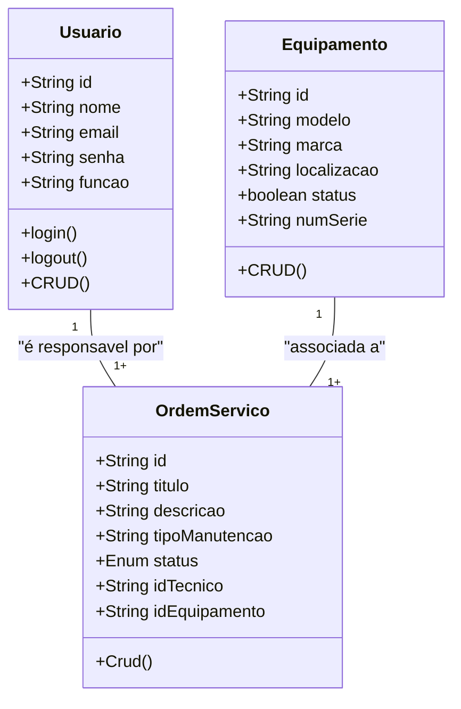

# Sistema de gestão de manutenção (SGM)

## Briefing

O projeto consiste no desenvolvimento de um Sistema de Gestão de Manutenção (SGM) no formato de uma aplicação web. O objetivo é centralizar e otimizar o controle das atividades de manutenção de máquinas e equipamentos de uma empresa. A plataforma permitirá o cadastro de equipamentos, agendamento de manutenções preventivas e corretivas, e o gerenciamento de ordens de serviço.

## Objetivo do Projeto

- Gerenciar informações sobre equipamentos e manutenções realizadas pela empresa
- realizar abertura de chamados de manutenção(ordens de serviço)
- dashboard de manutenção 
- proteger acesso aos dados do sistema (criptografia e autenticação segura de usuarios)

## Publico-Alvo

- Técnicos de Manutenção (usuarios finais)
- Gestores de manutenção (usuários inteermediários)
- Administradoresdo sistema( Gerenciar a permissão dos usuários)

## Levantamento de Requisitos do Projeto

- ### Requisitos Funcionais

- ### Requisitos Não Funcionais

## Recursos do Projeto
- ### Tecnológicos
    - Framework de Desenvolvimento: Next/React
    - Linguagem de programação: Typescript
    - Banco de Dados: Não Relacional( MongoDB)
    - GitHub
    - VsCode
    - Figma

- ### Humanos 
    - Dev FullStack

## Analise de Risco

## Diagramas
1. ### Classe
descreve o comportamento das Entidades de um projeto
    - Usuários(User/Usuario)
        - Atributos: id,nome,email,senha, função
        - métodos: create, read, update, delete, login, logout
    - Equipamentos(equipments)
        - Atributos:id,modelo,marca,localizção,status,
        numeroSerie
        - create, read, update, delete
    - Ordem de Serviço (OrdemServico)
        -Atributos:id,titulo,descrição,tipoManutenção,status,idTecnicp, IdEquipamento

